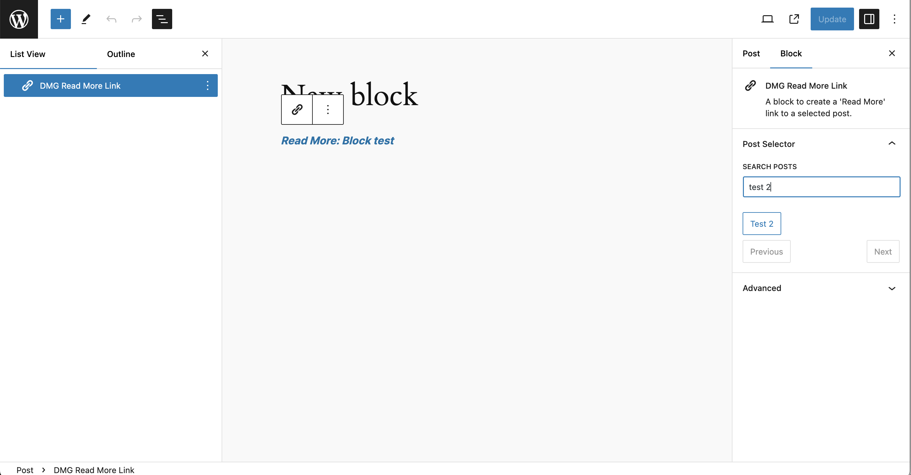
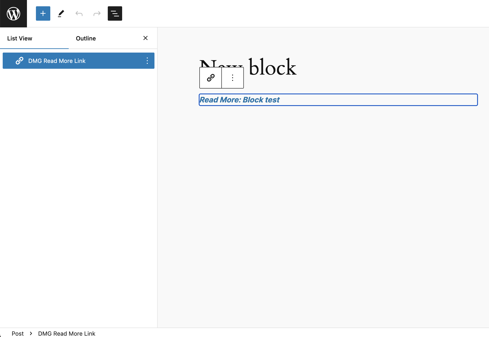

# === DMG Read More ===

Contributors: Tj Thouhid\
Tags: block, Gutenberg, WP-CLI, posts\
Tested up to: 6.1\
Stable tag: 0.1.0\
License: GPL-2.0-or-later\
License URI: https://www.gnu.org/licenses/gpl-2.0.html

A plugin that adds a custom Gutenberg block for linking to posts and a WP-CLI command for searching posts.

### == Description ==

DMG Read More is a versatile plugin that introduces a custom Gutenberg block allowing editors to create stylized anchor links to other posts. Additionally, the plugin includes a WP-CLI command for searching posts that contain the DMG Read More block within a specified date range.

### **Features:**

- Custom Gutenberg block to create anchor links to posts.
- Ability to search and select posts from the block's inspector controls.
- Supports pagination and search by post title or ID.
- WP-CLI command to search for posts containing the DMG Read More block within a date range.

### == Installation ==

This section describes how to install the plugin and get it working.

1. Upload the plugin files to the `/wp-content/plugins/dmg-read-more` directory, or install the plugin through the WordPress plugins screen directly.
2. Activate the plugin through the 'Plugins' screen in WordPress.

## == Frequently Asked Questions ==

= How do I use the DMG Read More block? =

After activating the plugin, you can find the DMG Read More block in the Gutenberg editor. Use the block's inspector controls to search for and select a post to link to.

= How do I run the WP-CLI command? =

Navigate to your WordPress installation directory in the terminal and use the following command:
`wp dmg-read-more search --date-before=YYYY-MM-DD --date-after=YYYY-MM-DD`
Replace `YYYY-MM-DD` with the desired dates to filter the posts.

### == Screenshots ==

1.  - The block's inspector controls for searching and selecting posts.
2.  - An example of the DMG Read More block in the editor.

### == Changelog ==

= 0.1.0 =

- Initial release with custom Gutenberg block and WP-CLI command.

### == Arbitrary section ==

### == WP-CLI Command Details ==

The `dmg-read-more search` WP-CLI command helps you find posts containing the DMG Read More block within a specified date range. This is particularly useful for large databases with millions of records.

### **Usage:**

```sh
wp dmg-read-more search --date-before=YYYY-MM-DD --date-after=YYYY-MM-DD
```

#### Arguments:

--date-before : The end date for the search range (inclusive).\
--date-after : The start date for the search range (inclusive).\
If no dates are provided, the command defaults to searching the last 30 days.

### == Support ==

For any support or questions, please open an issue on the [GitHub repository](https://github.com/tjthouhid/dmg-read-more).

## 🚀 About Me

I'm a full stack developer...

[](https://github.com/tjthouhid/)
[](https://www.linkedin.com/in/tjthouhid)
[](https://twitter.com/tjthouhid)
